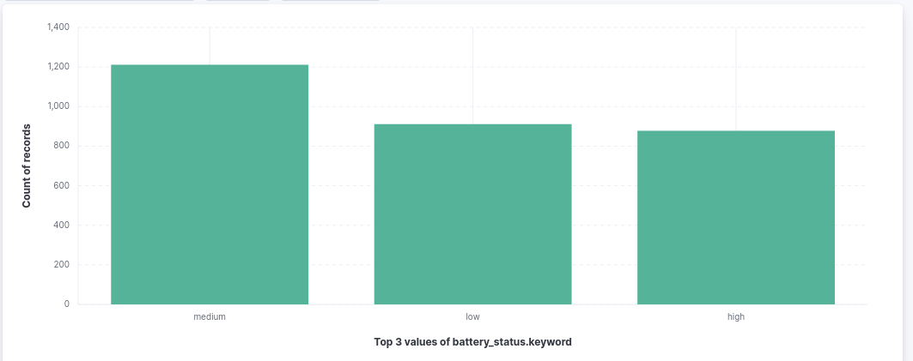
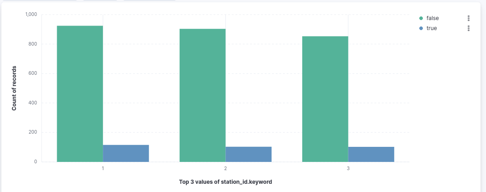
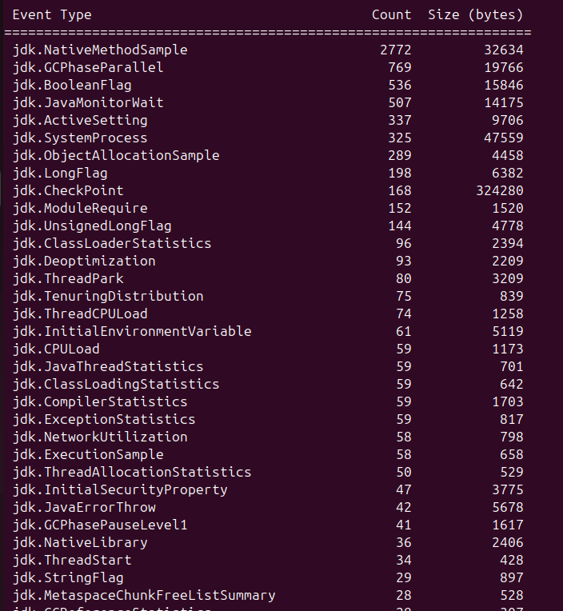
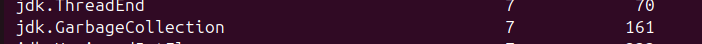
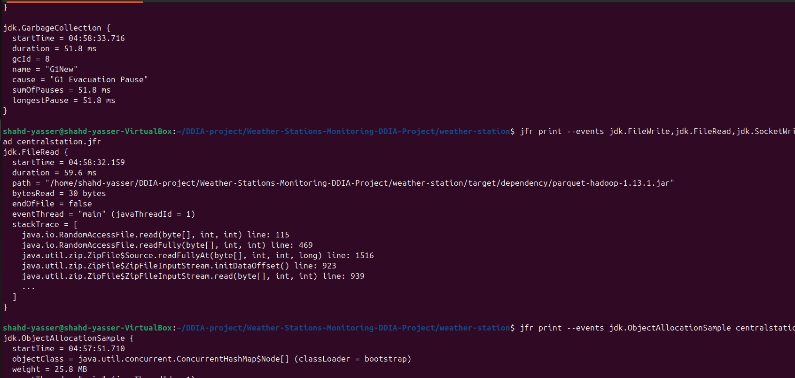
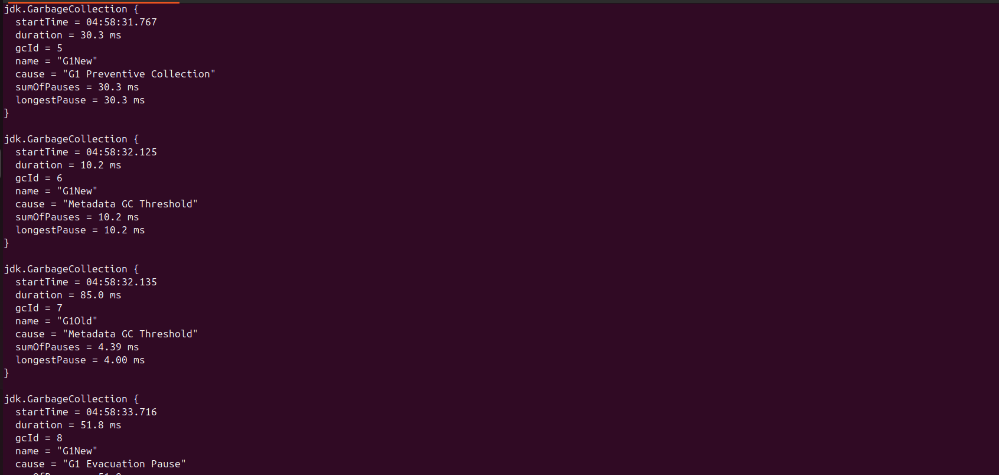
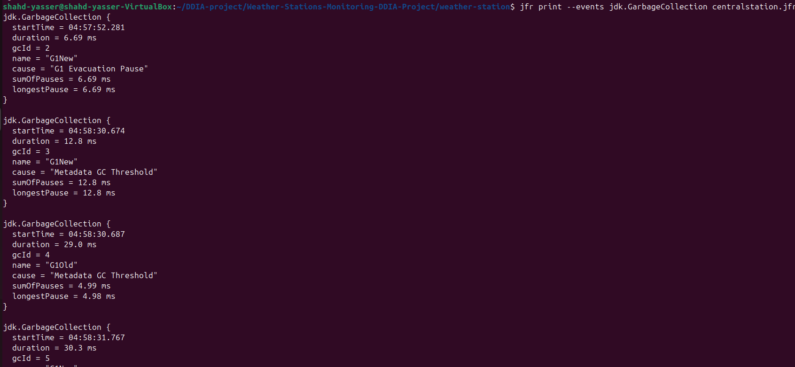
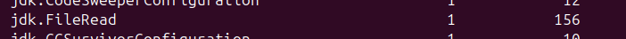
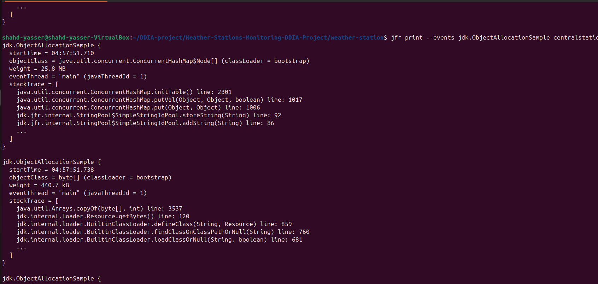

# Weather-Stations-Monitoring-DDIA-Project

## Project Overview

This project simulates a distributed weather monitoring system using Apache Kafka.

The system contains:

- Weather Stations (Kafka Producers)
- Central Station (Kafka Consumer)
- Weather Processor (Rain Trigger Detection)
- Kafka Topics for streaming and alerts

The processor analyzes incoming weather readings and publishes rain alerts when humidity exceeds 70%.

---

# Technologies Used

- Java
- Apache Kafka
- Docker
- Maven
- Jackson JSON Library

---

# Docker Containers Used

## Kafka Broker Container

Container Name:

```bash
broker
```

Docker Image:

```bash
apache/kafka:latest
```

Run Command:

```bash
docker run -d \
  --name broker \
  -p 9092:9092 \
  apache/kafka:latest
```

---

# Kafka Topics

## 1) weather-status

Main topic used by weather stations to publish weather readings.

Create Topic:

```bash
./kafka-topics.sh \
--create \
--topic weather-status \
--bootstrap-server localhost:9092
```

---

## 2) rain-alert

Topic used by the processor to publish rain alerts.

Create Topic:

```bash
./kafka-topics.sh \
--create \
--topic rain-alert \
--bootstrap-server localhost:9092
```

---

# Verify Existing Topics

```bash
./kafka-topics.sh \
--list \
--bootstrap-server localhost:9092
```

---

# Enter Kafka Container

```bash
docker exec --workdir /opt/kafka/bin/ -it broker sh
```

---

# Kafka Console Consumer Commands

## Read weather-status Topic

```bash
./kafka-console-consumer.sh \
--bootstrap-server localhost:9092 \
--topic weather-status \
--from-beginning
```

---

## Read rain-alert Topic

```bash
./kafka-console-consumer.sh \
--bootstrap-server localhost:9092 \
--topic rain-alert \
--from-beginning
```

---

# Implemented Steps

## 1) Kafka Setup

- Installed Docker
- Pulled Apache Kafka Docker image
- Started Kafka broker container
- Verified Kafka broker is running

---

## 2) Kafka Producer Test

Implemented a simple Kafka producer to verify Kafka connectivity.

Test message:

```text
Hey Kafka!
```

---

## 3) Weather Station Producer

Implemented a weather station simulator that:

- Generates random weather readings
- Generates battery status
- Simulates dropped messages
- Serializes weather data into JSON
- Publishes messages to Kafka topic `weather-status`

---

## 4) Kafka Consumer / Central Station

Implemented a central station service that:

- Subscribes to `weather-status`
- Consumes weather messages
- Deserializes JSON messages into Java objects
- Passes messages to the processor

---

## 5) Weather Processor

Implemented a weather processor that:

- Receives weather readings
- Detects rain conditions
- Publishes alerts to `rain-alert`

Rain detection rule:

```text
Humidity > 70%
```

---

# System Architecture

```text
Weather Station
       ↓
weather-status topic
       ↓
CentralStation
       ↓
WeatherProcessor
       ↓
rain-alert topic
```

---

# Initial Project File Structure

```text
Weather-Stations-Monitoring-DDIA-Project/
│
├── weather-station/
│   │
│   ├── pom.xml
│   │
│   └── src/main/java/com/weather/
|   ├── Weather.java
│   ├── WeatherMessage.java
|   ├── stations/
│   |   │
│   |   ├── WeatherStation.java
│   |   └── TestProducer.java
|   |
|   ├── centralstation/
│       │
│       ├── WeatherProcessor.java
│       └── centralStation.java
```

---

# JSON Weather Message Example

```json
{
  "station_id": 1,
  "s_no": 15,
  "battery_status": "medium",
  "status_timestamp": 1716322000,
  "weather": {
    "humidity": 82,
    "temperature": 23,
    "wind_speed": 44
  }
}
```

---

# Rain Alert Example

```text
RAIN ALERT -> Station 1 humidity = 82
```

---

# Maven Dependencies Used

## Kafka Clients

```xml
<dependency>
    <groupId>org.apache.kafka</groupId>
    <artifactId>kafka-clients</artifactId>
    <version>3.7.0</version>
</dependency>
```

---

## Jackson Databind

```xml
<dependency>
    <groupId>com.fasterxml.jackson.core</groupId>
    <artifactId>jackson-databind</artifactId>
    <version>2.17.0</version>
</dependency>
```

---

# Build Project


```bash
cd weather-station
mvn clean package
```

---

# Run Weather Station

```bash
java -lesaa
```

---

# Run Central Station

```bash
java lesaa
```


# ElasticSearch & Kibana Setup

## Pull ElasticSearch Image

```bash
docker pull elasticsearch:8.13.4
```

---

## Run ElasticSearch Container

```bash
docker run -d \
  --name elasticsearch \
  -p 9200:9200 \
  -e "discovery.type=single-node" \
  -e ES_JAVA_OPTS="-Xms512m -Xmx512m" \
  -e "xpack.security.enabled=false" \
  elasticsearch:8.13.4
```

The following JVM configuration reduces memory consumption for Virtual Machines:

```text
ES_JAVA_OPTS="-Xms512m -Xmx512m"
```

---

## Verify ElasticSearch

Open browser:

```text
http://localhost:9200
```

A JSON response confirms that ElasticSearch is running correctly.

---

## Pull Kibana Image

```bash
docker pull kibana:8.13.4
```

---

## Run Kibana Container

```bash
docker run -d \
  --name kibana \
  -p 5601:5601 \
  --link elasticsearch:elasticsearch \
  -e ELASTICSEARCH_HOSTS=http://elasticsearch:9200 \
  kibana:8.13.4
```

---

## Access Kibana Dashboard

Open browser:

```text
http://localhost:5601
```

---

# Kibana Analytics

The Kibana dashboards visualize:

- humidity trends
- temperature trends
- wind speed analytics
- low / medium / high battery status statistics
- dropped message statistics
- station activity monitoring

---

## Battery Status Statistics Dashboard

The following dashboard visualizes the distribution of:

- low battery
- medium battery
- high battery

using Kibana vertical chart analytics.



---

## Dropped Messages Dashboard

The following dashboard visualizes:

- dropped messages
- successfully delivered messages

to monitor communication reliability between weather stations and the central station.




---

# Build Weather Station Image

Inside `weather-station/`:

```bash
docker build -f Dockerfile.weather-stations -t weather-station .
```

---

# Build Central Station Image

Inside `weather-station/`:

```bash
docker build -f Dockerfile.central-stations -t central-station .
```

---

# Run Central Station Container

```bash
docker run --network host --name central central-station
```

---

# Run Weather Station Containers

## Station 1

```bash
docker run --network host weather-station 1
```

---

## Station 2

```bash
docker run --network host weather-station 2
```

---

## Station 3

```bash
docker run --network host weather-station 3
```

---

# Kubernetes deployment
- created 3 yaml files
- infrastructure.yaml -> to create the deployment for the kafka broker server
- central-station.yaml -> to create the presistent volume to hold the bitcask and parquet files, create the deployment of the app and create the network service to allow bitcask_client script to access the deployment from outside the cluster
- weather-station.yaml -> to run the 10 weather stations

## commands used:

```sh
minikube image load central-station-image:latest
minikube image load weather-station-image:latest
```
**to load the images into minikube**


```sh
kubectl apply -f infrastructure.yaml
kubectl apply -f centra-station-deployment.yaml
kubectl apply -f weather-stations-deployment.yaml
```

```sh
kubectl get pods
```
**to make sure our deployments are running**

```sh
kubectl exec deploy/central-station-deployment -- ls -lh /app/bitcask_data
kubectl exec deploy/central-station-deployment -- ls -lh /app/parquet_archives
```
**to make sure the bitcask and parquet files are created inside the volume**

```sh
kubectl logs -l app=weather-station-1 -f
kubectl logs -l app=central-station -f
```
**getting the logs of a specific deployment and quering it using its label**

```sh
 kubectl port-forward service/central-station-service 8888:8080
 ```
 **to forward the port for the bash script**

# Java Flight Recorder (JFR) Profiling

Since the Central Station is the core component of the data-intensive weather monitoring system, Java Flight Recorder (JFR) was used to analyze:

- memory consumption
- garbage collection behavior
- GC pauses
- file I/O operations
- runtime overhead

---

# Running Central Station with JFR

The Central Station was executed with Java Flight Recorder enabled for a duration of 1 minute using the following command:

```bash
java \
-XX:StartFlightRecording=duration=1m,filename=centralstation.jfr,settings=profile \
-cp "target/classes:target/dependency/*" \
com.weather.centralstation.CentralStation
```

---

# JFR Configuration Parameters

| Parameter | Description |
|---|---|
| `duration=1m` | Records profiling data for 1 minute |
| `filename=centralstation.jfr` | Saves profiling data into a `.jfr` file |
| `settings=profile` | Enables profiling-oriented monitoring settings |
| `-cp` | Specifies the application classpath |
| `com.weather.centralstation.CentralStation` | Starts the Central Station application |

---

# Workload Generation

During profiling, multiple Weather Station containers were executed simultaneously to generate realistic workload traffic:

```bash
docker run --network host weather-station 1
```

```bash
docker run --network host weather-station 2
```

```bash
docker run --network host weather-station 3
```

The workload generated:
- Kafka message streaming
- BitCask writes
- Parquet archival operations
- ElasticSearch indexing requests

---

# JFR Analysis Commands and Profiling Results

After recording completion, the generated `.jfr` file was analyzed using the built-in JFR command-line tools.

---

## Recording Duration

| Metric | Value |
|---|---|
| Recording Duration | 60 seconds |

---

## JFR Summary

```bash
jfr summary centralstation.jfr
```

This command provides:
- total recording duration
- number of recorded events
- allocation statistics
- garbage collection statistics
- I/O activity overview



---


## Garbage Collection Analysis

```bash
jfr print --events jdk.GarbageCollection centralstation.jfr
```

This command was used to analyze:
- GC pause count
- GC duration
- maximum pause duration
- G1New and G1Old collection events



# Garbage Collection Statistics

| Metric | Value |
|---|---|
| GC Pause Count | 7 |
| Maximum GC Event Duration | 85.0 ms |
| Maximum Stop-The-World Pause | 51.8 ms |



# GC Event Analysis

The JVM used the **G1 Garbage Collector**, which generated two main collection types:

| GC Type | Description |
|---|---|
| `G1New` | Cleans short-lived temporary objects |
| `G1Old` | Cleans long-lived objects and performs deeper memory cleanup |

Observed GC events:

| GC ID | Type | Duration |
|---|---|---|
| 2 | G1New | 6.69 ms |
| 3 | G1New | 12.8 ms |
| 4 | G1Old | 29.0 ms |
| 5 | G1New | 30.3 ms |
| 6 | G1New | 10.2 ms |
| 7 | G1Old | 85.0 ms |
| 8 | G1New | 51.8 ms |

---

# GC Pause Observations

JFR reports multiple timing metrics for garbage collection events:

| Metric | Meaning |
|---|---|
| `duration` | Total GC event runtime |
| `sumOfPauses` | Total application pause time |
| `longestPause` | Longest single stop-the-world pause |

In several events:

```text
sumOfPauses = longestPause
```

This indicates that only one application pause occurred during the collection cycle.

For the largest `G1Old` event:

```text
duration = 85.0 ms
sumOfPauses = 4.39 ms
longestPause = 4.00 ms
```

This means:
- the overall GC operation lasted 85 ms
- however, the application itself paused for only about 4 ms
- most cleanup work was performed concurrently in the background

This demonstrates efficient behavior of the G1 Garbage Collector.

The maximum observed stop-the-world pause was:

```text
51.8 ms
```

which indicates acceptable runtime overhead for the workload.




---

## I/O Operations Analysis

```bash
jfr print --events jdk.FileWrite,jdk.FileRead,jdk.SocketWrite,jdk.SocketRead centralstation.jfr
```

This command displays:
- file read operations
- file write operations
- Kafka socket communication
- ElasticSearch network activity



# I/O Operations Analysis

The profiling session recorded several I/O activities including:

- file read operations
- JAR dependency loading
- Kafka socket communication
- ElasticSearch HTTP communication
- Parquet archive access

Example recorded operation:

```text
jdk.FileRead
parquet-hadoop-1.13.1.jar
```

This confirms active filesystem interaction during runtime.


---

## Memory Allocation Analysis

```bash
jfr print --events jdk.ObjectAllocationSample centralstation.jfr
```

This command identifies:
- top allocated classes
- memory-heavy objects


# Top Memory Consuming Class

The following classes consumed the highest memory allocations during execution:

| Class | Approximate Memory Usage |
|---|---|
| `java.util.concurrent.ConcurrentHashMap$Node[]` | 25.8 MB |



---

# Memory Allocation Observations

The majority of allocations originated from:

- Kafka client internals
- JVM class loading
- string manipulation
- JAR decompression/loading
- network buffering

---


